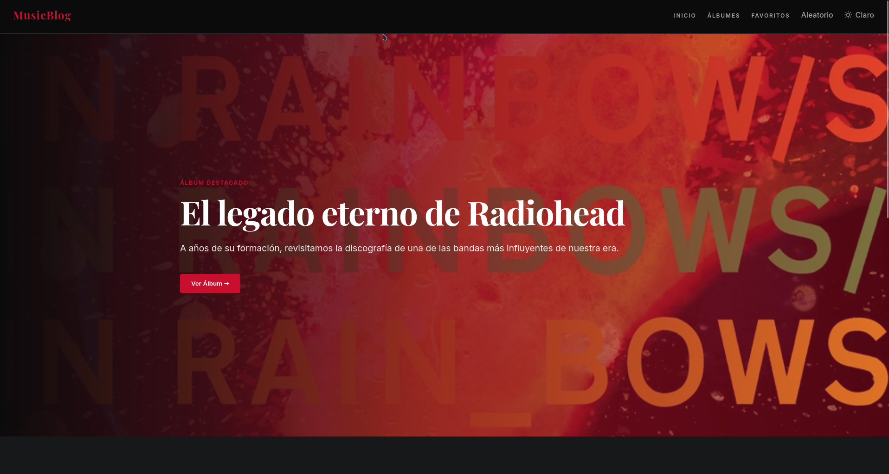
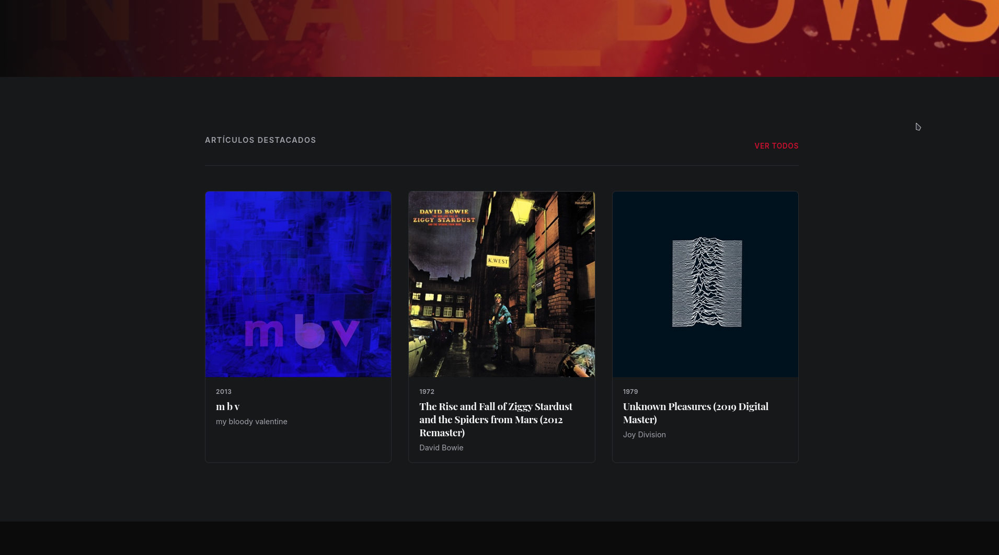
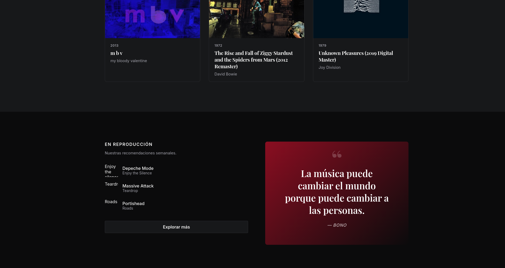
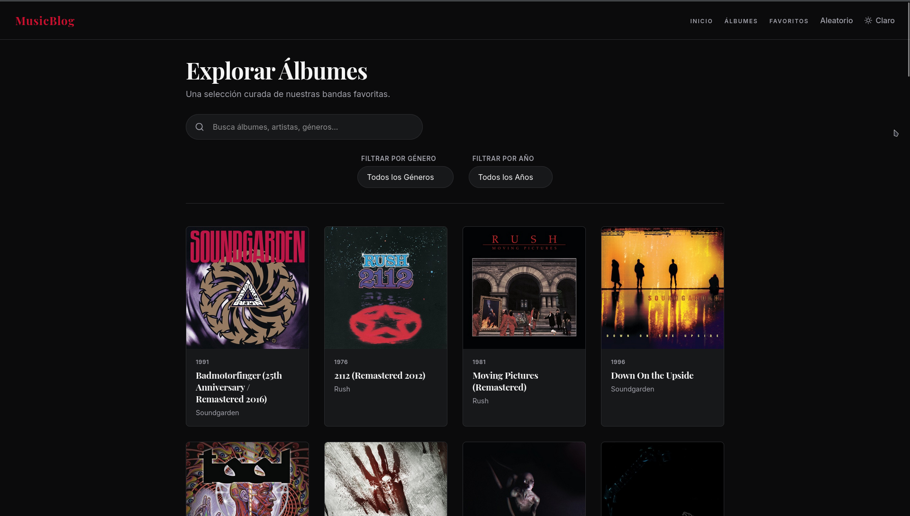
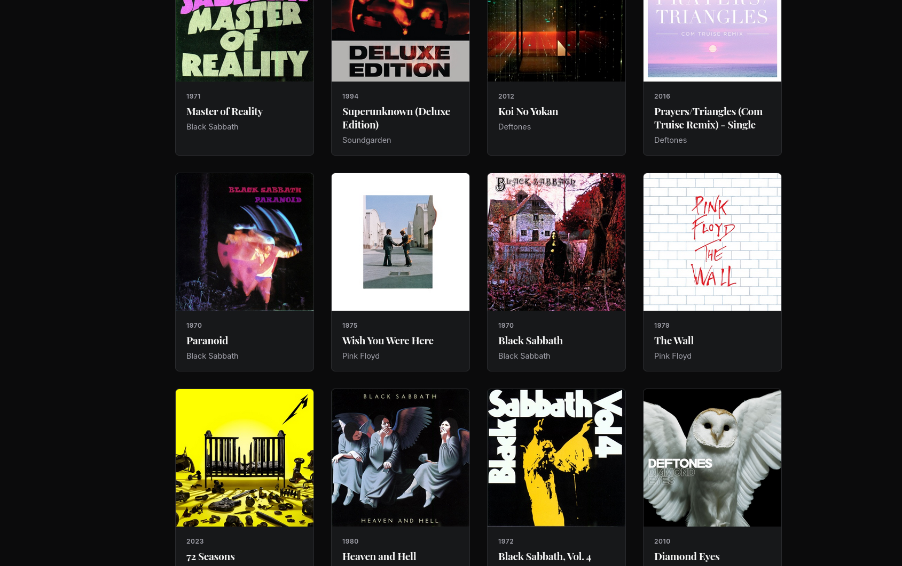
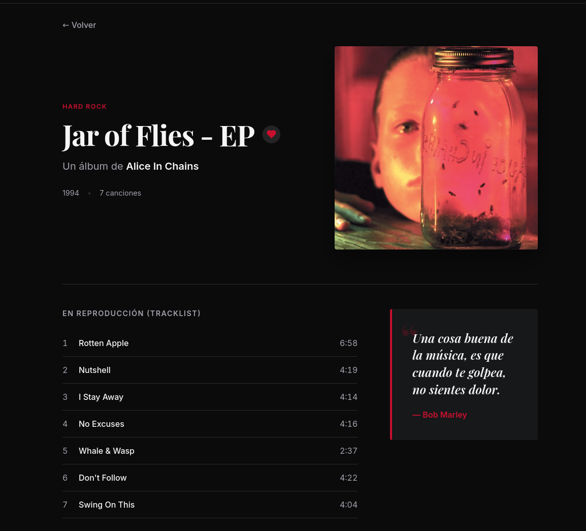
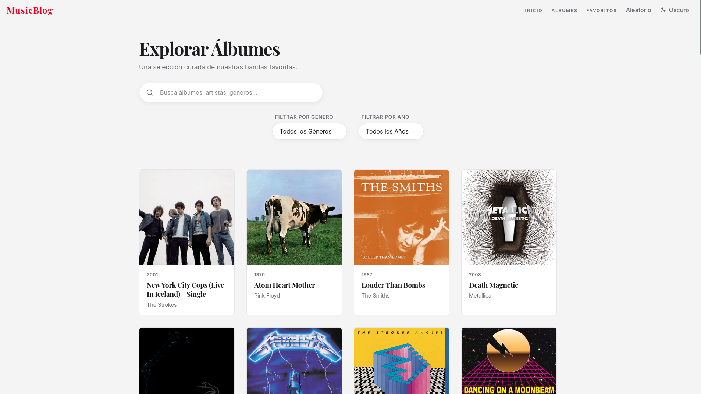

# Music Blog — Ejercicio 4: React

Mini-blog musical construido con Vite + React + React Router que consume la **iTunes Search API** en tiempo real. Permite explorar álbumes, filtrarlos, guardar favoritos y alternar entre modo claro y oscuro.

---

## Nivel Declarado: Senior (100 Puntos)

---

## Cómo correr el proyecto

> **Requisitos previos:** Node.js >= 18 y npm >= 9 instalados en tu máquina.

```bash
# 1. Clonar el repositorio
git clone <url-del-repo>
cd ej4-React

# 2. Instalar dependencias  <-- OBLIGATORIO, no saltarse este paso
npm install

# 3. Iniciar el servidor de desarrollo
npm run dev
```

Abre tu navegador en **http://localhost:5173**

> No se necesita ninguna API key ni archivo `.env`. La iTunes Search API es pública y gratuita.

### Otros comandos

```bash
npm run build    # Genera el build de producción en /dist
npm run preview  # Previsualiza el build localmente
npm run lint     # Ejecuta ESLint
```

---

## Capturas de pantalla

### Home




### Listado de álbumes



### Detalle de álbum


### Modo claro


---

## Video de demostración

El video de demostración está disponible en YouTube:

**[Ver demo en YouTube](https://youtu.be/e0u8y4jldnE)**

Muestra las 4 rutas funcionando: Home (`/`), Listado (`/items`), Detalle (`/items/:id`) y Favoritos (`/favorites`).

> El archivo `demo.mp4` original fue excluido del repositorio vía `.gitignore` por su tamaño (~102 MB). En su lugar se incluye `demo/demo.txt` con el enlace al video.

---

## Rutas implementadas

| Ruta | Componente | Descripción |
| :--- | :--- | :--- |
| `/` | `Home.jsx` | Página de bienvenida editorial |
| `/items` | `ItemsList.jsx` | Listado con búsqueda, filtros y álbum aleatorio |
| `/items/:id` | `ItemDetail.jsx` | Detalle completo del álbum con tracklist |
| `/favorites` | `Favorites.jsx` | Álbumes guardados como favoritos |
| `*` | `NotFound.jsx` | Página 404 para rutas no encontradas |

---

## Stack tecnológico

- **Vite** — bundler y servidor de desarrollo
- **React 19** — librería de UI
- **React Router DOM v7** — enrutamiento del lado del cliente
- **PropTypes** — validación de tipos en componentes
- **iTunes Search API** — fuente de datos (pública, sin API key)

---

## Checklist de requerimientos y puntaje

### Nivel Junior — 70 pts base
- [x] Proyecto generado con `npm create vite@latest`
- [x] `react-router-dom` con rutas anidadas
- [x] 4 rutas implementadas: `/`, `/items`, `/items/:id`, `/favorites`
- [x] Datos en espacio separado (`src/data/constants.js` + `src/services/itunesApi.js`) — **0 datos hardcodeados en componentes**
- [x] `useParams` en `ItemDetail.jsx` para leer el `:id` de la URL
- [x] Navegación exclusivamente con `<Link>` y `useNavigate` — **0 etiquetas `<a>` estáticas**
- [x] README con instrucciones de instalación
- [x] Video de demostración — enlace en `demo/demo.txt` (YouTube)

### Nivel Mid — +15 pts (requiere 3 de 4, se cumplen los 4)
- [x] Página 404 (`NotFound.jsx`) para cualquier ruta no definida
- [x] Búsqueda y filtros en `ItemsList.jsx`: texto con debounce de 1 s, filtro por género y filtro por año
- [x] Botón "Álbum aleatorio" en el Navbar — genera término aleatorio, consulta la API y navega con `useNavigate`
- [x] Componente reutilizable con props documentadas: `AlbumCard.jsx` (ver tabla más abajo)

### Nivel Senior — +15 pts (requieren los 3, se cumplen los 3)
- [x] Estado global con Context API: `ThemeContext` (modo claro/oscuro) y `FavoritesContext` (favoritos)
- [x] PropTypes definidos en 3 componentes: `AlbumCard.jsx`, `ThemeProvider` y `FavoritesProvider`
- [x] API externa: consumo dinámico de la iTunes Search API en `src/services/itunesApi.js`

### Descuentos
- [x] Sin uso de `<a>` estáticas — **0 descuentos**
- [x] README completo — **0 descuentos**
- [x] Video presente (enlace YouTube en `demo/demo.txt`) — **0 descuentos**
- [x] Sin datos hardcodeados en componentes — **0 descuentos**
- [x] `node_modules` en `.gitignore` — **0 descuentos**

### Puntaje final: **100 / 100**

---

## Componente reutilizable: `AlbumCard`

`src/components/AlbumCard.jsx` se puede usar en cualquier grilla de la aplicación.

```jsx
<AlbumCard
  id={123456}
  title="OK Computer"
  artist="Radiohead"
  coverUrl="https://is1-ssl.mzstatic.com/image/..."
  releaseDate="1997-05-21T07:00:00Z"
/>
```

| Prop | Tipo | Requerido | Descripción |
| :--- | :--- | :---: | :--- |
| `id` | `number` | Si | ID único del álbum (`collectionId` de iTunes). Usado para enrutamiento y favoritos. |
| `title` | `string` | Si | Nombre del álbum. |
| `artist` | `string` | Si | Nombre del artista o banda. |
| `coverUrl` | `string` | Si | URL de la portada. El componente la escala internamente a 400x400. |
| `releaseDate` | `string` | No | Fecha ISO 8601. El componente extrae y muestra solo el año. |

---

## Arquitectura del proyecto

```
src/
├── components/
│   ├── AlbumCard.jsx   # Tarjeta reutilizable con favorito integrado
│   ├── Layout.jsx      # Wrapper con Navbar y Outlet
│   └── Navbar.jsx      # Barra de navegación y botón aleatorio
├── contexts/
│   ├── FavoritesContext.jsx  # Estado global de favoritos
│   └── ThemeContext.jsx      # Estado global del tema claro/oscuro
├── data/
│   └── constants.js    # Configuración estática y términos de búsqueda
├── pages/
│   ├── Home.jsx        # Portada editorial
│   ├── ItemsList.jsx   # Listado con búsqueda y filtros
│   ├── ItemDetail.jsx  # Detalle + tracklist del álbum
│   ├── Favorites.jsx   # Lista de favoritos guardados
│   └── NotFound.jsx    # Página 404
└── services/
    └── itunesApi.js    # Capa de acceso a la iTunes Search API
```